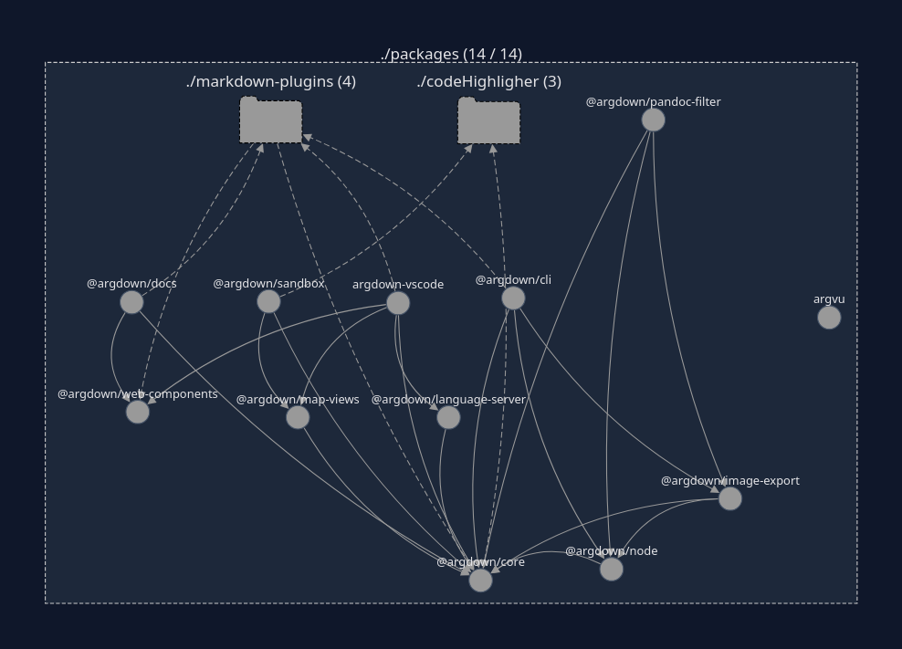

# General information
This Repo is a monorepo where the packages are placed inside of the packages folder. We use lerna as monorepo management tool and yarn as dependency manager.

- install requirements
    - `node>=22.11.0` (e.g. via [`nvm`](https://github.com/nvm-sh/nvm)),
    - `yarn>=4.9.4` (via [`corepack`](https://yarnpkg.com/corepack))
- run `yarn install` in the main folder to install the dependencies of all packages.

## Structural overview
To view the nx dependency graph, run `yarn run graph`. Argdown provides plugins for other tools, like markdown parsers, code highlighter, vscode etc.


### Core Functionality
- The main functionality of argdown is defined inside the @argdown/core package. @argdown/node extends this functionality by providing access to node specify capabilities (like filesystem access).
- @argdown/map-views provides functionality to work with the rendered maps
- @argdown/web-components is a web component, that can toggle between map and source view. It is only a wrapper and does not generate the map or evaluates argdown sources. The developer needs to provide the svg and html, generated by an argdown application
- @argdown/image-export is a custom @argdown/node plugin to export images

### CLI
@argdown/cli uses a @argdown/node application and interface to interact with .argdown files from the terminal

### Docs
@argdown/docs documents the use of the argdown ecosystem.

### Language Server
@argdown/language-server is an implementation of the language server protocol. https://microsoft.github.io/language-server-protocol/

The language server gets build for node and browser environment, because the vs code extension requires both. More information can be found in the PRs: https://github.com/argdown/argdown/pull/517 and https://github.com/argdown/argdown/pull/523

### Sandbox
@argdown/sandbox is a web application, that allows the user to parse argdown online.

### VS code extension
@argdown/vs-code defines the vs code extension. We bundle with esbuild for browser and node environments, to support vscode-web. More information can be found in this PR: https://github.com/argdown/argdown/pull/523

### markdown-plugins
All packages inside of the markdown-plugin folder, are plugins for some markdown parser.

### code-highlighter
All packages inside of the code-highlighter folder, are plugins for some code highlighter.


# Development
Run `yarn run dev` inside of the packages that you want to edit to compile typescript in watch mode or run the bundler in watch mode. Most of the packages use vite and provide a sandbox for better iteration. Refer to the script definition inside of the corresponding package.json

# Manuel Deployment
While a CICD pipeline is not setup, manuel deployment has to do.

## To NPM Registry
Notes: We can not deploy with changeset, because of https://github.com/changesets/changesets/issues/1454

1. login to npm: `npm login`
2. Add your token to an .yarnrc.yml file (if you add it to this local .yarnrc.yml file, **DONT FORGET TO REMOVE IT**, before commit):
  ```yaml
  npmAuthToken: <your token (starts with "npm_")>
  ```
3. Version the packages with changeset: `yarn changeset` + `yarn changeset version`
4. Publish each package with `yarn npm publish --access public`

## The docs website
Move to the docs package (cd package/argdown-docs)
1. Init the github pages branch inside of the dist folder
2. build the docs with `yarn run build:all`
3. force push to gh-pages branch

```bash
cd docs/.vitepress/dist
git clone -b gh-pages https://github.com/argdown/argdown.git .
yarn run build:all
git add -A
git commit -m "update docs"
git push --force-with-lease
```
